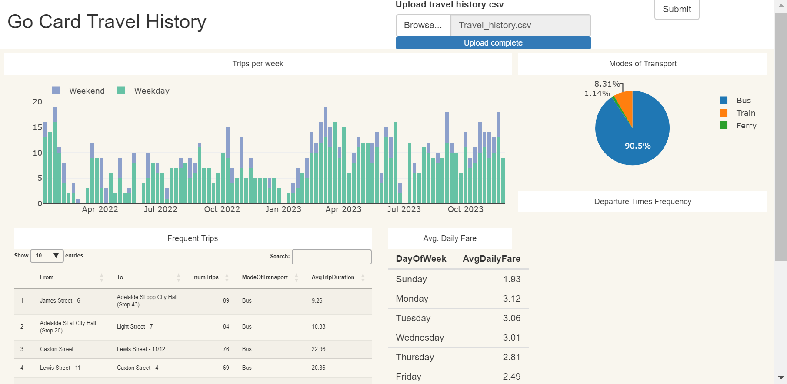

# rShinyGoCardTravelHistory

The inspiration behind this project was initially creating a power bi dashboard to reveal insights from my own go card data (Brisbane's public transport system) to analyse my travel habits.

From here, I decided to try and re-create the power bi dashboard in R as a way to teach myself how to use rShiny.

This involved both re-creating the data cleaning (more info below) steps performed in power query in R as well as recreating the visuals and designing the dashboard layout with rShiny.

The final result, while not a fully complete recreation proved to be a challenge with displaying the data in the same way as power bi - working with a dataframe opposed to a data model of related tables.

One key difference with the rShiny dashboard is ability for the report viewer to upload any input file (in the expected format) and for the data transformation steps to be automatically applied and displayed in the dashboard. As such, this allows for me to upload my project without revealing my own data as well as for others to download their own travel history from the translink website and upload it to the dashboard.

#### Some key learnings from this project:
* R is more suitable for statistical analysis
* Power BI is my preferred tool for creating mroe interactive dashboards
* rShiny is a lot more closely related to CSS than I anticpated
* divs are my new best friend :)

### Data Cleaning
Asides from exploring the different dashboard visualisation tools as above, the initial driver of this project was collecting the travel history data available to me and transforming it in such a way that it was useful enough to find patterns from. Some of the key transformations are listed below:
* Removing 'top-up' or 'failed to touch off' entries from the dataset that did not represent complete trips
* Collating a [list of all train stations in the network](TrainStations.txt) to join with the data to identify the mode of transport of a trip as bus, train or ferry
* Creating a datetime dimension table to allow for temporal analysis

The above transformations were initially performed in power query but the r-versions for the rShiny project can be found in [travel_history_dataframe.R](travel_history_dataframe.R).